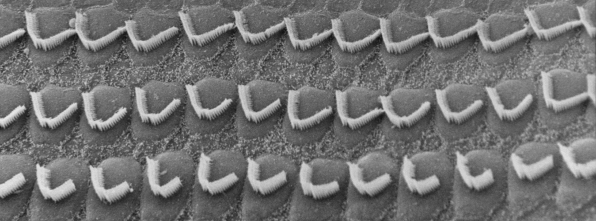

## About me

I'm a graduate fellow in the lab of [A. James Hudspeth](https://www.rockefeller.edu/our-scientists/heads-of-laboratories/1186-a-james-hudspeth/) at Rockefeller University. I study the development and regeneration of highly-specialized sensory cells in the inner ear using single-cell genomics, deep learning, and dynamical systems theory. 

> "Evolution is the control of development by ecology" -Leigh Van Valen

## Publications

Check out my publications on [Google Scholar](https://scholar.google.com/citations?user=OrpTjvIAAAAJ&hl=en)



## Curriculum vitae

### Research fellowships

```
Graduate Research Fellowship, NSF GRFP, 2021
Graduate Fellowship, Rockefeller University, 2020 
NSF REU program, University of Pittsburgh, 2018
```

### Education

```
BS in molecular biology & applied math (chemistry minor), Lipscomb University, 2019, Summa Cum Laude
```

### Science Outreach

```
Mentor, John F. Kennedy High School Student Research Mentorship Program, 2020
Judge, Weill Cornell Medicine High School Science Immersion Program, 2019
```

### Organizations
 
```
CBM & RU student councils, 2020/21
New York Academy of Sciences, 2019
Tri-Beta Biological Honors Society, 2017
```

### Awards
 
```
Major Field Achievement Award, Lipscomb University, 2019
Pryor Prize in Mathematics, Alpha Chi National Honors Society, 2019
Revelle Prize in Molecular and Cellular Biology, Alpha Chi National Honors Society, 2018
```

### Selected graduate coursework

```
Deep Learning, Cornell Tech, 2021
Statistical Mechanincs, NYU, 2020
Neuronal Networks, NYU Courant, 2019
CNS Development, Rockefeller, 2020
```


The Philosopher's Garden at Rockefeller University
