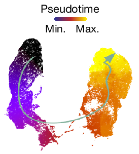

# Professional Summary
I'm a Ph.D. data scientist with deep expertise in **_time-series analysis, graph theory, and advanced machine learning_** for <ins>data-driven problem solving</ins>. I have 5+ years’ experience in developing end-to-end pipelines for translating multi-scale datasets into meaningful insights and actionable knowledge. I develop parsimonious approaches to solve complex, high-dimensional problems while delivering both granular and high-level understanding of models’ behaviors. My work emphasizes cross-functional approaches drawing on techniques from computer vision, autoregressive modeling, and causal inference.

> **_I deliver creative solutions to pressing research problems, and I'm ready to contribute to a new, dynamic data-science environment._**

# Research Competencies
## High-dimensional & multi-modal data analysis
- In my Ph.D., I analyzed high-dimensional datasets describing single cells' unique profiles using sparse `cell x gene` matrices with thousands of individual features and up to millions of unique observations:

> |         | G₁ | ⋯ | Gₘ |
> |---------|----|----|----|
> | C₁      | ⋱  | ⋯  | ⋰  |
> | ⋮       | ⋮  | ⋮  | ⋮  |
> | Cₙ      | ⋰  | ⋯  | ⋱  |

- These datasets often comprised multiple `cell x feature` matrices that described distinct aspects of cells' biology.

- To analyze these datasets, I used unsupervised machine-learning methods such as *t*-SNE and Louvain clustering:


> Reagor & Hudspeth, 2024, [bioRxiv](https://doi.org/10.1101/2024.10.15.618534)

## Deep learning for causal time-series analysis

- For my Ph.D., I developed a deep-learning algorithm called DELAY for reconstructing causal networks from single-cell data
- Single-cell datasets contain information about cells' relative maturity during processes like human brain development:    



> Mannens, ..., Reagor, et al., 2024, [Nature](https://doi.org/10.1038/s41586-024-07234-1)

- I developed DELAY to encode noisy gene-expression data as images, similar to a Granger Causality test


- DELAY uses a supervised convolutional neural network to classify images as either interacting or non-interacting gene pairs


## Publications

Check out my publications on [Google Scholar](https://scholar.google.com/citations?user=OrpTjvIAAAAJ&hl=en) <a itemprop="sameAs" content="https://orcid.org/0000-0002-8304-1267" href="https://orcid.org/0000-0002-8304-1267" target="orcid.widget" rel="me noopener noreferrer" style="vertical-align:top;"></a>


### Fellowships

```
Karolinska Institutet Nicholson Postdoc, 2025
Karolinska Institutet Nicholson Fellowship, 2022
NSF Graduate Research Fellowship Program, 2021
Graduate Fellowship, Rockefeller University, 2020 
NSF REU Program, University of Pittsburgh, 2018
```

### Education

```
PhD in Computational Biology & Medicine, The Rockefeller University, 2024
BS in Molecular Biology & Applied Mathematics, Lipscomb University, 2019
```

### Organizations
 
```
Rockefeller Student Representative Council, 2020
New York Academy of Sciences Member, 2019
Tri-Beta Biological Honors Society, 2017
```


The Philosopher's Garden at Rockefeller University
