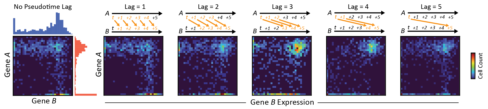
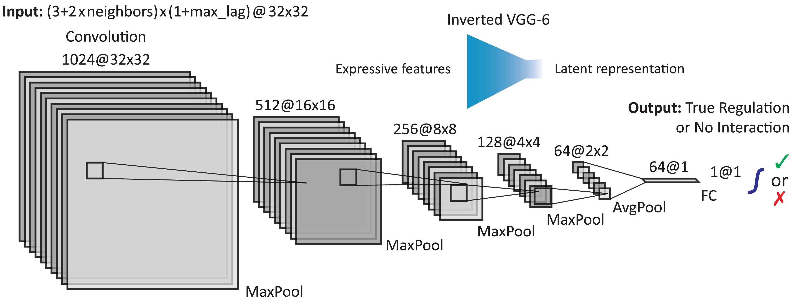
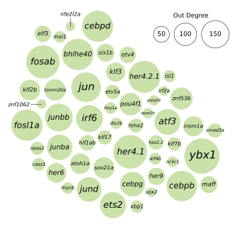

# Projects
## Big-data analytics
- I have _six years of experience analyzing large-scale and high-dimensional datasets_ from biological experiments with millions of observations (cells) and thousands of features (genes):

> |          | Gene_1 | Gene_2 | ⋯   | Gene_m |
> |----------|--------|--------|-----|--------|
> | Cell_1   |   ⋯    |   ⋯    | ⋯   |   ⋯    |
> | Cell_2   |   ⋯    |   ⋯    | ⋯   |   ⋯    |
> | ⋯        |   ⋯    |   ⋯    | ⋯   |   ⋯    |
> | Cell_n   |   ⋯    |   ⋯    |  ⋯   |   ⋯    |

---

## Deep learning for time series

- I developed and maintain the deep-learning method [DELAY](https://github.com/calebclayreagor/DELAY) to reconstruct causal networks from temporal biological data

- DELAY encodes autoregressive relationships between features (genes) as 3D stacks of 2D images

> 

> Reagor, Velez-Angel & Hudspeth, 2023, [*PNAS Nexus*](https://doi.org/10.1093/pnasnexus/pgad113)

- DELAY uses a CNN to classify features as either interacting (A -> B) or non-interacting (A -x-> B) 

> 

---

## Large-scale network analysis

- I used graph-structure analysis to discover influential nodes (genes) in the reconstructed networks

> 
