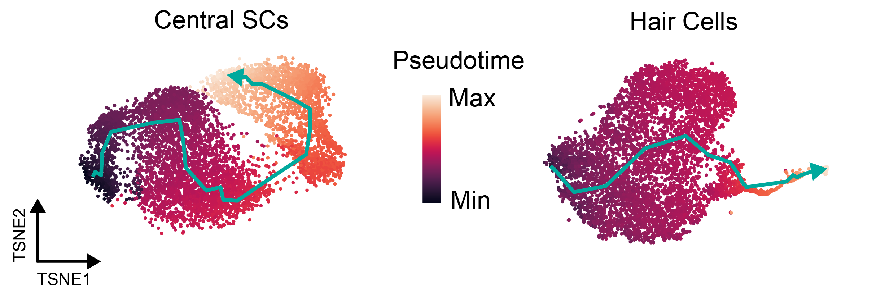
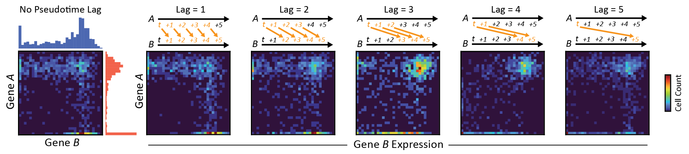
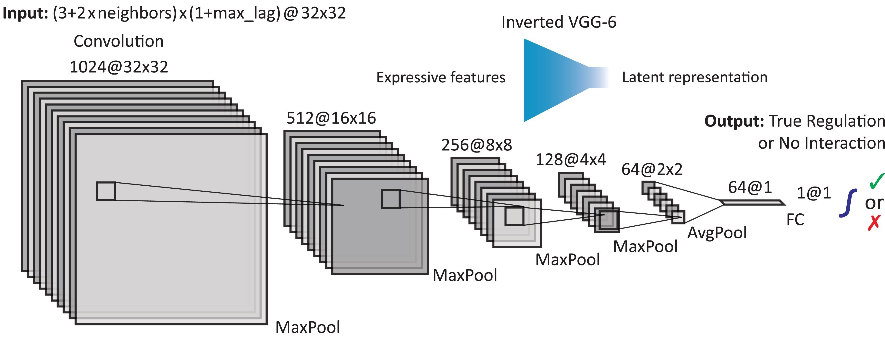
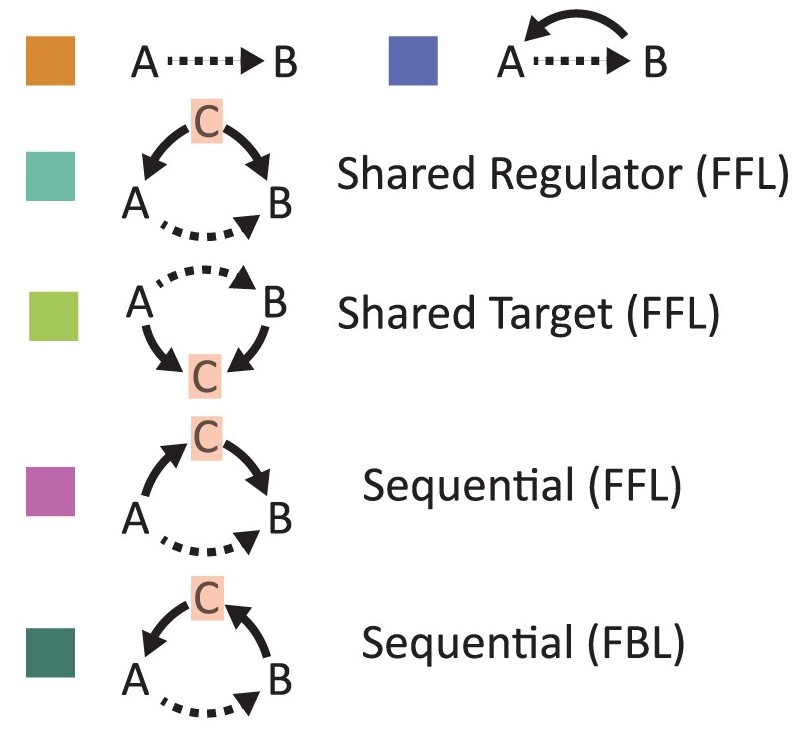
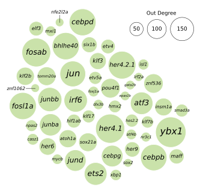
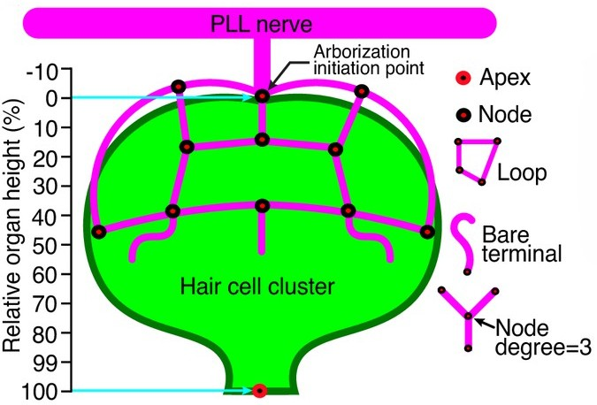
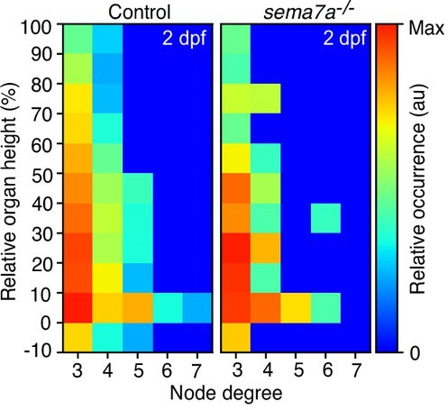

# Research Skills
## High-dimensional & multi-modal data analysis
- In my Ph.D., I analyzed high-dimensional datasets of single cells' unique profiles from sparse `cell x gene` matrices with thousands of individual features and up to tens of millions of unique observations:

> |          | Gene_1 | Gene_2 | ⋯   | Gene_m |
> |----------|--------|--------|-----|--------|
> | Cell_1   |   ⋯    |   ⋯    | ⋯   |   ⋯    |
> | Cell_2   |   ⋯    |   ⋯    | ⋯   |   ⋯    |
> | ⋯        |   ⋯    |   ⋯    | ⋯   |   ⋯    |
> | Cell_n   |   ⋯    |   ⋯    |  ⋯   |   ⋯    |

- These datasets comprised multi-modal `cell x feature` matrices of cells' distinct biological properties

- To analyze these datasets, I used unsupervised machine-learning methods such as *t*-SNE and Louvain clustering:

> 

> Reagor & Hudspeth, 2024, [*bioRxiv*](https://doi.org/10.1101/2024.10.15.618534)

- These datasets can also reveal cells' relative maturities during processes like tissue regeneration

>  

## Deep learning for causal time-series analysis

- I developed the deep-learning method DELAY to reconstruct causal gene-regulatory networks from single-cell gene-expression datasets

- I designed DELAY to encode noisy gene-expression data as images for deep learning using concepts from Granger Causality 

> 

> Reagor, Velez-Angel & Hudspeth, 2023, [*PNAS Nexus*](https://doi.org/10.1093/pnasnexus/pgad113)

- DELAY uses a supervised convolutional neural network to classify images as either interacting or non-interacting gene pairs

> 

## Analysis of large-scale networks

- DELAY effectively reconstructs large-scale networks by inferring causal interactions between individual gene pairs

> 

> DELAY learns to encode contextual information about higher-order interactions

- DELAY successfully identifies central hubs in large-scale networks that regulate networks' temporal dynamics

> 

- Beyond DELAY, I developed custom scripts to quantify and analyze large neuronal networks from microscopy images

> 
> 

> Dasgupta, Reagor, *et al.*, 2024, [*eLife*](https://doi.org/10.7554/eLife.89926.4)
